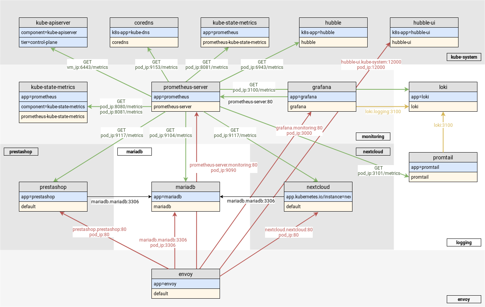

# Secure your application on SUSE CaaS Platform with Cilium




## Deploy

### CaaSP Cluster

```bash
skuba cluster init --control-plane 10.17.2.0 my-cluster
cd my-cluster/
skuba node bootstrap --user sles --sudo --target 10.17.2.0 susecon-master-0 -v4
skuba node join --role worker --user sles --sudo --target 10.17.3.0 susecon-worker-0 -v4

cp /root/libvirt/my-cluster/admin.conf ~/.kube/config
```

### Upgrade cilium

```bash
kubectl delete -f caasp-cluster/addons/cilium/cilium.yaml
kubectl apply -f deployment/prereq/cilium.yaml
```

### Prerequisites

```bash
kubectl apply -f deployment/prereq
```

### MariaDB

```bash
kubectl -n mariadb apply -f deployment/charts/mariadb
mysql -u root -h 10.17.3.0 -psusecon < misc/mariadb.sql
```

### Charts

```bash
./deployment/manage_charts.sh.sh template
./deployment/manage_charts.sh.sh deploy
```

### tblshoot

```bash
deploy-tblshoot-pods
```
