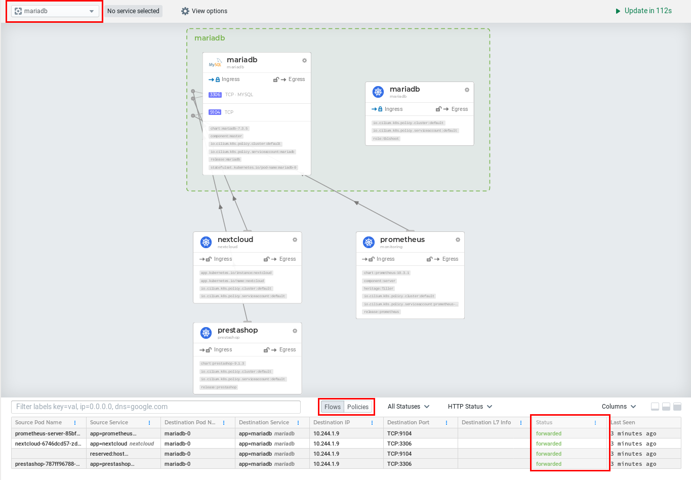
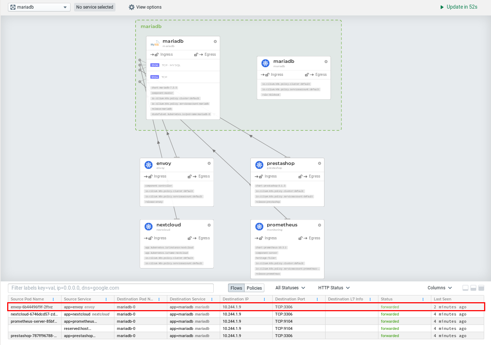
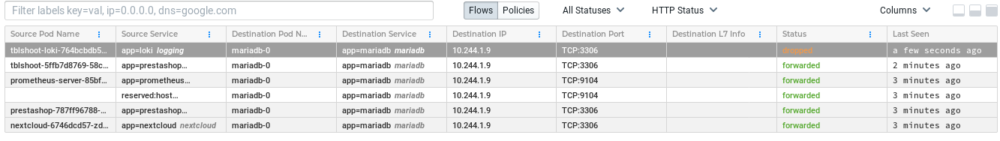

apiVersion: "cilium.io/v2"
kind: CiliumNetworkPolicy
description: "Allow ingress from webapp and metrics"
metadata:
  name: "ingress-webapp-metrics"
  namespace: mariadb
spec:
  endpointSelector:
    matchLabels:
      app: mariadb
  egress:
  - {}
  ingress:
  - fromEndpoints:
    - matchLabels:
        "io.kubernetes.pod.namespace": "nextcloud"
        "app.kubernetes.io/instance": "nextcloud"
    - matchLabels:
        "io.kubernetes.pod.namespace": "prestashop"
        "app": "prestashop"
    - matchLabels:
        "io.kubernetes.pod.namespace": "envoy"
        "app": "envoy"
    - matchLabels:
        "io.kubernetes.pod.namespace": "monitoring"
        "app": "prometheus"
```

And Apply it in the cluster:

```bash
kubectl apply -f mariadb-l3.yaml
```

Remember it is possible to see the network policies:

```bash
kubectl -n mariadb get cnp
```

## Visualize with Hubble

Let's visualize in Hubble if our traffic is still forwarded:

1. In a browser reach `https://hubble.susecon.lab`
2. Select `mariadb` namespace
3. Check the `Status` of the flows in green or red
4. You can also vizualize the policy by clicking on `Policies`



As we can see, every traffic is still forwarded, this probably means that
the policy worked but maybe our policy didn't match the pod so it does not
have any effect ? we'll check that just after :smile:

Hubble only shows when there is traffic, for example here, we
don't see traffic from envoy because we haven't generated any traffic.
Let's do a quick test:

```bash
mysql -u root -h 10.17.3.0 -psusecon -e quit
```

Now we see the traffic originated from envoy:




## Trace with cilium

`cilium policy trace` is extremely powerful when troubleshooting policies.

First, let's test `egress`, normally, we should not be able to reach
any other pod, even the one allowed in ingress.

* Can we reach nextcloud ?

```bash
$ kubectl -n kube-system exec -ti ds/cilium -- cilium policy trace --src-k8s-pod mariadb:mariadb-0 --dst any:app.kubernetes.io/instance=nextcloud,io.kubernetes.pod.namespace=nextcloud
----------------------------------------------------------------
Tracing From: [k8s:app=mariadb, k8s:chart=mariadb-7.3.5, k8s:component=master, k8s:io.cilium.k8s.policy.cluster=default, k8s:io.cilium.k8s.policy.serviceaccount=mariadb, k8s:io.kubernetes.pod.namespace=mariadb, k8s:release=mariadb, k8s:statefulset.kubernetes.io/pod-name=mariadb-0] => To: [any:app.kubernetes.io/instance=nextcloud, any:io.kubernetes.pod.namespace=nextcloud] Ports: [0/ANY]

Resolving egress policy for [k8s:app=mariadb k8s:chart=mariadb-7.3.5 k8s:component=master k8s:io.cilium.k8s.policy.cluster=default k8s:io.cilium.k8s.policy.serviceaccount=mariadb k8s:io.kubernetes.pod.namespace=mariadb k8s:release=mariadb k8s:statefulset.kubernetes.io/pod-name=mariadb-0]
* Rule {"matchLabels":{"any:app":"mariadb","k8s:io.kubernetes.pod.namespace":"mariadb"}}: selected
1/1 rules selected
Found no allow rule
Egress verdict: denied


Final verdict: DENIED
```

The interestings flags are:

* **--src-k8s-pod mariadb:mariadb-0**: because we use a StatefulSet, the name of the pod
will be always the same so we don't really need to use a label here.
* **--dst any:app.kubernetes.io/instance=nextcloud,io.kubernetes.pod.namespace=nextcloud**: always
the same with our beloved Kubernetes, we select the destination pods using labels.

Here we can see the trace from our mariadb pod to the nextcloud pod in the nextcloud namespace,
that there is a rule in a policy selecting the mariadb pod and that egress is denied.


* Can we be reached from nextcloud ?


```bash
$ kubectl -n kube-system exec -ti ds/cilium -- cilium policy trace --src any:app.kubernetes.io/instance=nextcloud,io.kubernetes.pod.namespace=nextcloud --dst-k8s-pod mariadb:mariadb-0
----------------------------------------------------------------

Tracing From: [any:app.kubernetes.io/instance=nextcloud, any:io.kubernetes.pod.namespace=nextcloud] => To: [k8s:app=mariadb, k8s:chart=mariadb-7.3.5, k8s:component=master, k8s:io.cilium.k8s.policy.cluster=default, k8s:io.cilium.k8s.policy.serviceaccount=mariadb, k8s:io.kubernetes.pod.namespace=mariadb, k8s:release=mariadb, k8s:statefulset.kubernetes.io/pod-name=mariadb-0] Ports: [0/ANY]

Resolving ingress policy for [k8s:app=mariadb k8s:chart=mariadb-7.3.5 k8s:component=master k8s:io.cilium.k8s.policy.cluster=default k8s:io.cilium.k8s.policy.serviceaccount=mariadb k8s:io.kubernetes.pod.namespace=mariadb k8s:release=mariadb k8s:statefulset.kubernetes.io/pod-name=mariadb-0]
* Rule {"matchLabels":{"any:app":"mariadb","k8s:io.kubernetes.pod.namespace":"mariadb"}}: selected
    Allows from labels {"matchLabels":{"any:app.kubernetes.io/instance":"nextcloud","any:io.kubernetes.pod.namespace":"nextcloud"}}
    Allows from labels {"matchLabels":{"any:app":"prestashop","any:io.kubernetes.pod.namespace":"prestashop"}}
    Allows from labels {"matchLabels":{"any:app":"envoy","any:io.kubernetes.pod.namespace":"envoy"}}
    Allows from labels {"matchLabels":{"any:app":"prometheus","any:io.kubernetes.pod.namespace":"monitoring"}}
      Found all required labels
1/1 rules selected
Found allow rule
Ingress verdict: allowed

Final verdict: ALLOWED
```

* Can we be reached from prometheus ?

```bash
$ kubectl -n kube-system exec -ti ds/cilium -- cilium policy trace --src any:app=prometheus,io.kubernetes.pod.namespace=nextcloud --dst-k8s-pod mariadb:mariadb-0
----------------------------------------------------------------

Tracing From: [any:app=prometheus, any:io.kubernetes.pod.namespace=nextcloud] => To: [k8s:app=mariadb, k8s:chart=mariadb-7.3.5, k8s:component=master, k8s:io.cilium.k8s.policy.cluster=default, k8s:io.cilium.k8s.policy.serviceaccount=mariadb, k8s:io.kubernetes.pod.namespace=mariadb, k8s:release=mariadb, k8s:statefulset.kubernetes.io/pod-name=mariadb-0] Ports: [0/ANY]

Resolving ingress policy for [k8s:app=mariadb k8s:chart=mariadb-7.3.5 k8s:component=master k8s:io.cilium.k8s.policy.cluster=default k8s:io.cilium.k8s.policy.serviceaccount=mariadb k8s:io.kubernetes.pod.namespace=mariadb k8s:release=mariadb k8s:statefulset.kubernetes.io/pod-name=mariadb-0]
* Rule {"matchLabels":{"any:app":"mariadb","k8s:io.kubernetes.pod.namespace":"mariadb"}}: selected
    Allows from labels {"matchLabels":{"any:app.kubernetes.io/instance":"nextcloud","any:io.kubernetes.pod.namespace":"nextcloud"}}
    Allows from labels {"matchLabels":{"any:app":"prestashop","any:io.kubernetes.pod.namespace":"prestashop"}}
    Allows from labels {"matchLabels":{"any:app":"envoy","any:io.kubernetes.pod.namespace":"envoy"}}
    Allows from labels {"matchLabels":{"any:app":"prometheus","any:io.kubernetes.pod.namespace":"monitoring"}}
      No label match for [any:app=prometheus any:io.kubernetes.pod.namespace=nextcloud]
1/1 rules selected
Found no allow rule
Ingress verdict: denied

Final verdict: DENIED
```

It looks like it's working :smile: our rules are applied to the pod.
We'll see with our upgraded policy how we can be more specific when
tracing a policy.

## Test it in CLI

In each namespace runs a `tblshoot` pod with the same labels as the associacted
workload that we can use to test connections, for example, let's try to connect
to mariadb from the `tblshoot` pod associated with loki:

```bash
$ tblshoot-loki

/ # nc -w 3 -v -z mariadb.mariadb.svc.cluster.local 3306
nc: connect to mariadb.mariadb.svc.cluster.local port 3306 (tcp) timed out: Operation in progress

/ # mysql --connect-timeout 3 -u root -psusecon -h mariadb.mariadb.svc.cluster.local -e quit
ERROR 2002 (HY000): Can't connect to MySQL server on 'mariadb.mariadb.svc.cluster.local' (110)
```

It's blocked ! Hubble can confirm :wink:




The same command but with the `tblshoot` pod associated with prestashop:

```bash
$ tblshoot-prestashop
/ # nc -w 3 -v -z mariadb.mariadb.svc.cluster.local 3306
Connection to mariadb.mariadb.svc.cluster.local 3306 port [tcp/mysql] succeeded!

/ # mysql --connect-timeout 3 -u root -psusecon -h mariadb.mariadb.svc.cluster.local -e quit
```

It works !


## A beefier policy

In order to harden our first policy, we will add L4 and L7 filtering. For the purpose
of the Labs, we will also use ServiceAccounts to match endpoints.

The policy covers:
* `L3 label-based`
* `L4`
* `L7 HTTP`
* `L7 Kubernetes ServiceAccount`

Create `mariadb-full.yaml`:

```
---
apiVersion: "cilium.io/v2"
kind: CiliumNetworkPolicy
description: "Allow ingress from webapp and metrics"
metadata:
  name: "ingress-webapp-metrics"
  namespace: mariadb
spec:
  endpointSelector:
    matchLabels:
      app: mariadb
  egress:
  - {}
  ingress:
  - fromEndpoints:
    - matchLabels:
        "io.kubernetes.pod.namespace": "nextcloud"
        "app.kubernetes.io/instance": "nextcloud"
    - matchLabels:
        "io.kubernetes.pod.namespace": "prestashop"
        "app": "prestashop"
    - matchLabels:
        "io.kubernetes.pod.namespace": "envoy"
        "app": "envoy"
    toPorts:
    - ports:
      - port: "3306"
        protocol: TCP
    - matchLabels:
        "io.kubernetes.pod.namespace": "monitoring"
        io.cilium.k8s.policy.serviceaccount: prometheus-server
      toPorts:
      - ports:
        - port: "9104"
          protocol: TCP
          rules:
            http:
            - method: "GET"
              path: "/metrics"
```

1. Nextcloud, Prestashop and envoy can only reach mariadb pod
using `TCP` on port `3306`.
2. The pods running in `monitoring` namespace with the ServiceAccount
`prometheus-server` can only reach mariadb pod using `TCP` on port `9104`
only with HTTP method `GET` on path `/metrics`


Now let's try again to trace the policy with cilium by using the same
command we used to see if we can be reached from nextcloud ?


```
$ kubectl -n kube-system exec -ti ds/cilium -- cilium policy trace --src any:app.kubernetes.io/instance=nextcloud,io.kubernetes.pod.namespace=nextcloud --dst-k8s-pod mariadb:mariadb-0 
----------------------------------------------------------------

Tracing From: [any:app.kubernetes.io/instance=nextcloud, any:io.kubernetes.pod.namespace=nextcloud] => To: [k8s:app=mariadb, k8s:chart=mariadb-7.3.5, k8s:component=master, k8s:io.cilium.k8s.policy.cluster=default, k8s:io.cilium.k8s.policy.serviceaccount=mariadb, k8s:io.kubernetes.pod.namespace=mariadb, k8s:release=mariadb, k8s:statefulset.kubernetes.io/pod-name=mariadb-0] Ports: [0/ANY]

Resolving ingress policy for [k8s:app=mariadb k8s:chart=mariadb-7.3.5 k8s:component=master k8s:io.cilium.k8s.policy.cluster=default k8s:io.cilium.k8s.policy.serviceaccount=mariadb k8s:io.kubernetes.pod.namespace=mariadb k8s:release=mariadb k8s:statefulset.kubernetes.io/pod-name=mariadb-0]
* Rule {"matchLabels":{"any:app":"mariadb","k8s:io.kubernetes.pod.namespace":"mariadb"}}: selected
    Allows from labels {"matchLabels":{"any:app.kubernetes.io/instance":"nextcloud","any:io.kubernetes.pod.namespace":"nextcloud"}}
    Allows from labels {"matchLabels":{"any:app":"prestashop","any:io.kubernetes.pod.namespace":"prestashop"}}
    Allows from labels {"matchLabels":{"any:app":"envoy","any:io.kubernetes.pod.namespace":"envoy"}}
      Found all required labels
      Allows port [{3306 TCP}]
        No port match found
      Allows port []
        No port match found
1/1 rules selected
Found no allow rule
Ingress verdict: denied

Final verdict: DENIED
```

That's interesting, all what we do in the policy is to specify a port and a protocol :thinking:.
This means for us that we have to be more accurate in what we want to trace, let's add a flag
in our request to specify the port we want to use:

```
$ kubectl -n kube-system exec -ti ds/cilium -- cilium policy trace --src any:app.kubernetes.io/instance=nextcloud,io.kubernetes.pod.namespace=nextcloud --dst-k8s-pod mariadb:mariadb-0 --dport 3306/tcp
----------------------------------------------------------------

Tracing From: [any:app.kubernetes.io/instance=nextcloud, any:io.kubernetes.pod.namespace=nextcloud] => To: [k8s:app=mariadb, k8s:chart=mariadb-7.3.5, k8s:component=master, k8s:io.cilium.k8s.policy.cluster=default, k8s:io.cilium.k8s.policy.serviceaccount=mariadb, k8s:io.kubernetes.pod.namespace=mariadb, k8s:release=mariadb, k8s:statefulset.kubernetes.io/pod-name=mariadb-0] Ports: [3306/TCP]

Resolving ingress policy for [k8s:app=mariadb k8s:chart=mariadb-7.3.5 k8s:component=master k8s:io.cilium.k8s.policy.cluster=default k8s:io.cilium.k8s.policy.serviceaccount=mariadb k8s:io.kubernetes.pod.namespace=mariadb k8s:release=mariadb k8s:statefulset.kubernetes.io/pod-name=mariadb-0]
* Rule {"matchLabels":{"any:app":"mariadb","k8s:io.kubernetes.pod.namespace":"mariadb"}}: selected
    Allows from labels {"matchLabels":{"any:app.kubernetes.io/instance":"nextcloud","any:io.kubernetes.pod.namespace":"nextcloud"}}
    Allows from labels {"matchLabels":{"any:app":"prestashop","any:io.kubernetes.pod.namespace":"prestashop"}}
    Allows from labels {"matchLabels":{"any:app":"envoy","any:io.kubernetes.pod.namespace":"envoy"}}
      Found all required labels
      Allows port [{3306 TCP}]
      Allows port []
        No port match found
1/1 rules selected
Found allow rule
Ingress verdict: allowed

Final verdict: ALLOWED
```

YES, that was it !

Now you can play to see what's working or not.

* nextcloud to mariadb on port 3306 without protocol

```bash
kubectl -n kube-system exec -ti ds/cilium -- cilium policy trace --src any:app.kubernetes.io/instance=nextcloud,io.kubernetes.pod.namespace=nextcloud --dst-k8s-pod mariadb:mariadb-0 --dport 3306
```

* nextcloud to mariadb on port 3306 in UDP

```bash
kubectl -n kube-system exec -ti ds/cilium -- cilium policy trace --src any:app.kubernetes.io/instance=nextcloud,io.kubernetes.pod.namespace=nextcloud --dst-k8s-pod mariadb:mariadb-0 --dport 3306/udp
```

* nextcloud to mariadb on metrics port 9104 in TCP

```bash
kubectl -n kube-system exec -ti ds/cilium -- cilium policy trace --src any:app.kubernetes.io/instance=nextcloud,io.kubernetes.pod.namespace=nextcloud --dst-k8s-pod mariadb:mariadb-0 --dport 9104/tcp
```


Network Policies - Envoy
========================


Apply Network Policies
======================


Congrats !!
